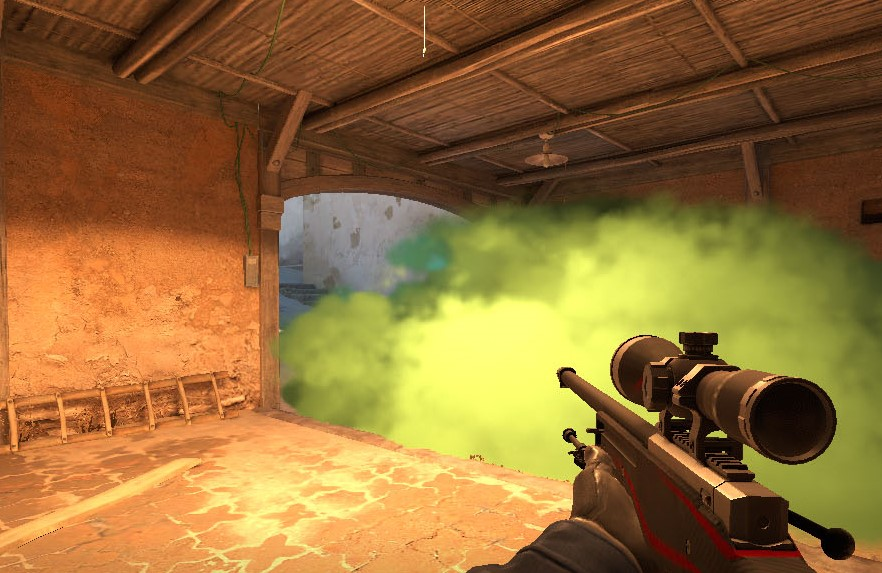

# CS2 Simple ColoredSmoke


This is a simple plugin that automatically changes the default smoke color to random colors.

# Requirements
[Latest release of Counter Strike Sharp](https://github.com/roflmuffin/CounterStrikeSharp)



# Instalation
- Download the latest release from [https://github.com/abnerfs/Simple-ColoredSmoke/releases](https://github.com/M1Kac/Simple-ColoredSmoke/tags)
- Extract the .zip file into `addons/counterstrikesharp/plugins`
- Enjoy

### Configuration

Configuration file generated on addons/counterstrikesharp/configs/plugins/ColoredSmoke/ColoredSmoke.json
```json
{
  "Enabled": true,
  "Flag": "", //
  "Color": "random", // red, blue, green, purple, orange, cijan & random
  "ConfigVersion": 1
}
```
